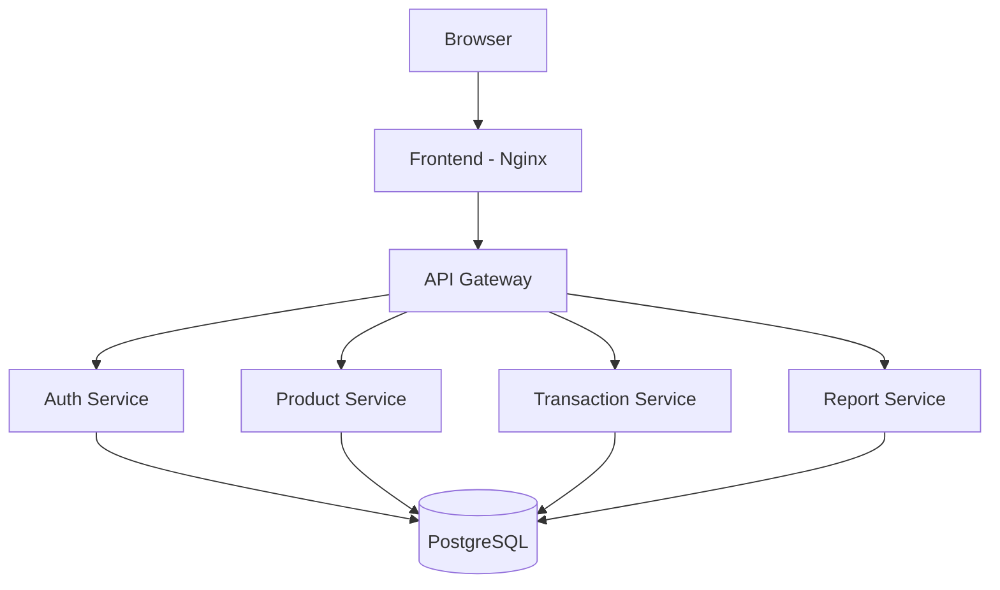

# IMS V2 - Inventory Management System

<p align="center">
  
  
  
  
  
</p>

## Overview

IMS V2 (Inventory Management System) is a microservices-based inventory management platform developed as a Software Architecture course project at Phenikaa University.

The system helps organizations manage products, inventory transactions, stock alerts, user accounts, and reporting through a scalable and maintainable architecture.

The project demonstrates the practical application of:

- Microservices Architecture
- API Gateway Pattern
- C4 Model Documentation
- Architecture Decision Records (ADR)
- Docker Containerization
- RESTful API Design
- JWT Authentication & Role-Based Access Control

---

## Key Features

### Authentication & Authorization

- JWT-based authentication
- Role-Based Access Control (RBAC)
- Administrator and Staff roles
- Secure password hashing using bcrypt

### Product Management

- Product CRUD operations
- Product Group & Variant hierarchy
- SKU-based inventory structure
- Product search and filtering

### Inventory Transactions

- Stock Import
- Stock Export
- Inventory movement tracking
- Audit history

### Stock Alert System

- Low stock detection
- Out-of-stock monitoring
- Real-time notification updates
- Threshold-based alerts

### Reporting

- Inventory KPI reporting
- Transaction summaries
- Dashboard analytics
## System Architecture



---

### Architecture Highlights

- API Gateway as the single entry point
- Independent business services
- Shared PostgreSQL database
- Docker-based deployment
- RESTful inter-service communication
## Technology Stack

### Backend

- Node.js 20 LTS
- Express.js
- JWT
- bcrypt
- Axios

### Frontend

- HTML5
- CSS3
- Vanilla JavaScript

### Database

- PostgreSQL 15

### DevOps

- Docker
- Docker Compose
- Nginx

### Architecture & Design

- Microservices Architecture
- API Gateway Pattern
- Repository Pattern
- C4 Model
- ADR Documentation

## Project Structure

```text
IMS_V2
|
|-- database
|   |-- init.sql
|
|-- frontend
|   |-- index.html
|   |-- app.js
|   |-- style.css
|   |-- nginx.conf
|
|-- services
|   |-- api-gateway
|   |-- auth-service
|   |-- product-service
|   |-- transaction-service
|   |-- report-service
|
|-- docs
|
|-- docker-compose.yml
|
|-- README.md
```
## Functional Modules

| Module | Description |
|----------|----------|
| Authentication | User login and access control |
| Product Management | Product and SKU management |
| Transactions | Import and export operations |
| Alerts | Low-stock monitoring |
| Reports | KPI and inventory reports |
| User Management | Account administration |

---

## API Overview

### Authentication

```http
POST /api/auth/login
```

### Products

```http
GET    /api/products
POST   /api/products
PUT    /api/products/:id
DELETE /api/products/:id
```

### Transactions

```http
GET  /api/transactions
POST /api/transactions
```

### Reports

```http
GET /api/reports/full
```

---

## Deployment

### Prerequisites

- Docker Desktop
- Docker Compose
- Git

### Clone Repository

```bash
git clone https://github.com/Cel-Azura/Inventory-Management-system.git
cd Inventory-Management-system
```

### Start Application

```bash
docker-compose up --build
```

### Access System

| Service | URL |
|----------|----------|
| Frontend | http://localhost |
| API Gateway | http://localhost:3000 |

---

## Demo Accounts

| Role | Username | Password |
|--------|----------|----------|
| Admin | admin | admin123 |
| Admin | manager | manager123 |
| Staff | staff | staff123 |
| Staff | kho1 | kho1123 |

---

## Testing Summary

The system was tested using:

- Functional Testing
- Integration Testing
- Security Testing
- Negative Testing

### Results

| Category | Pass | Fail |
|-----------|------|------|
| Functional Tests | 28 | 0 |
| Security Tests | 4 | 0 |
| Total | 32 | 0 |

**Overall Pass Rate: 100%**

---

## Architecture Documentation

This project includes:

- C4 Level 1 – System Context Diagram
- C4 Level 2 – Container Diagram
- C4 Level 3 – Component Diagram
- ERD
- Class Diagram
- Sequence Diagrams
- Activity Diagrams
- Architecture Decision Records (ADR)

---

## Future Improvements

- Per-service databases
- Automated CI/CD pipeline
- Refresh Token Authentication
- Redis Caching
- React/Vue Frontend
- Email Notifications
- Kubernetes Deployment
- AI-based Demand Forecasting

---

## Contributors

### Ninh Quang

Software Engineering Student  
Phenikaa University

---

## License

This project is developed for educational and academic purposes.
